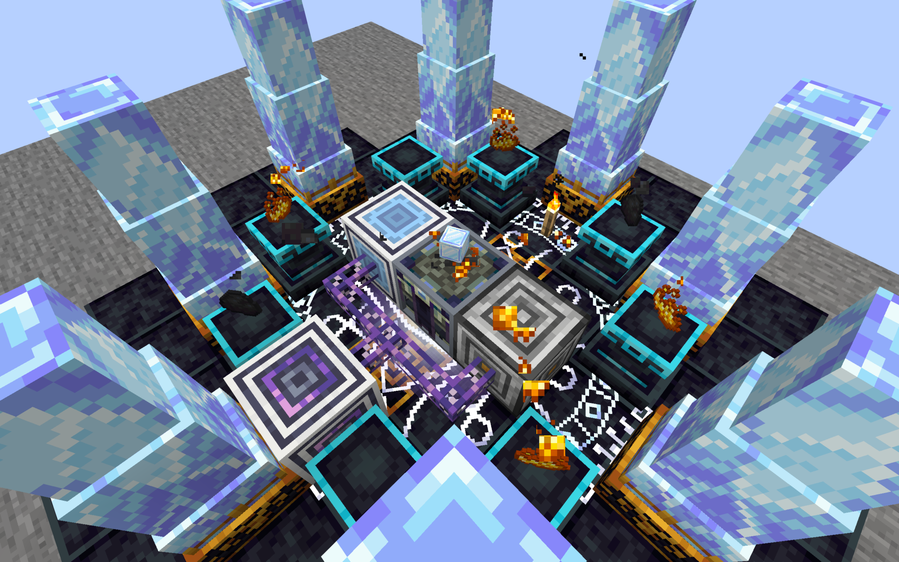
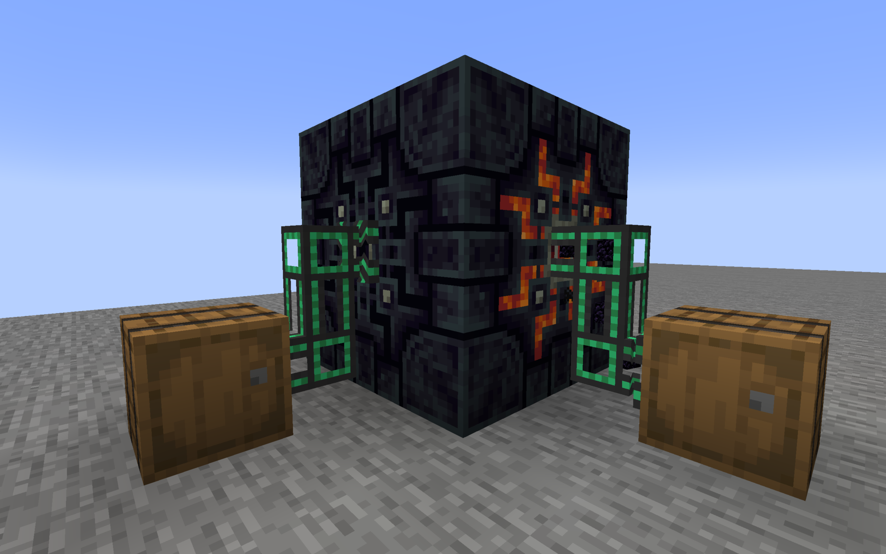
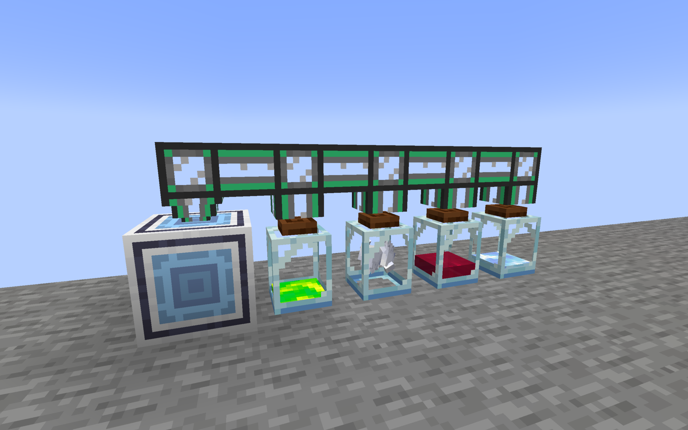

# PackagedFAA / 封包FAA

- Packaged Hephaestus Forge / 封包赫菲斯托斯锻炉
  - Placing Packaged Pedestals around a Packaged Forge will allow it to accept packaged recipes
    在锻炉周围放置基座即可使其接受封包配方
  - Packaged Forge accepts `Fluid Essence` instead of essence
    锻炉接受 `流体精华` 而不是精华
  - It automatically extracts the `fluid essence` from adjacent containers to satisfy ritual requirements
    它会自动提取相邻容器的 `流体精华` 以满足仪式要求
  - Use `Enhancer Items` on it to add `Enhancers`
    对它使用 `Enhancer Item` 以为它添加 `Enhancer`
    

- Clibano
  - Now Clibano can be interacted with by pipes through the center plane
    现在Clibano可以被管道等从中心交互

- Fluid Essences
  - Also accepts other fluids with the same tag
    也接受相同标签的其他流体
  - Utrem Jars / 瓶罐
    - Now Utrem Jars can be interacted as fluid containers
      现在瓶罐可以被视为流体容器交互
    - Extract the essence stored in it to convert it into `Fluid Essence`
      提取其中存储的精华就可以得到 `流体精华`
    - Shift click an empty jar to switch its essence mode
      Shift点击一个空瓶罐可以切换它的精华储存种类

- Essences Produce / 精华生成
  - Aureal / 耀金
    - Removing a *normal* forge from a forge structure causes the surrounding Mystic Crystal Obelisks to start generating `Fluid Aureal`
      移除锻炉结构中的*普通*锻炉可以使周围的神秘水晶方尖碑开始生成 `流体耀金`
  - Blood / 血
    - When an entity dies around a blood jar, the corresponding `Fluid Blood` will be generated according to its health value
      在血瓶罐周围有生物死亡时根据其生命值产生相应的 `流体血`
  - Souls / 灵魂
    - Placing Soul Sand/Soil within a 5^3 range centered on a souls jar can cause the jar to absorb the soul and produce `Fluid Soul`
      在以灵魂瓶罐为中心5^3范围内放置灵魂沙/土可以使瓶罐吸收其中的灵魂并产出 `流体灵魂`
  - Experience / 经验
    - Experience jars will regularly absorb the surrounding experience orbs within a 5^3 range and convert them into `Fluid Experience`
      经验瓶罐会定时吸收周围5^3范围内的经验球并将其转化为 `流体经验`